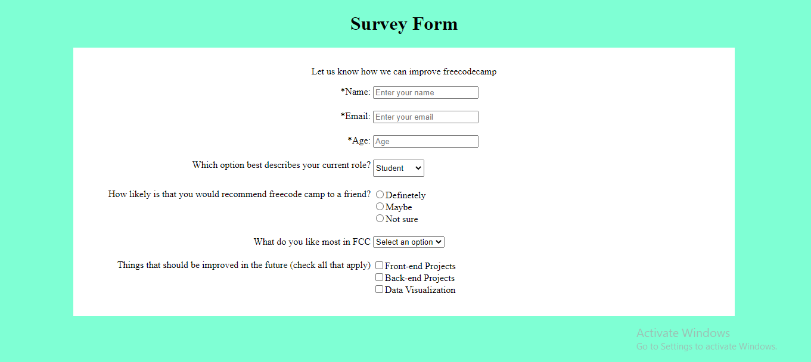

# Form-on-survey

This is a sample survey form of a company.

* Based for department A

* Based for department B

* Based for department C



## Preview
View http://127.0.0.1:5500/

## Built with
1. HTML
2. css

* Technologies used

 - GIT(Version control)

 ## Getting Started
 To get a local copy follow these steps
 `git clome`

 ```
 - git clone
 ```

 ### prequisities
 - A Text Editor

 ### Install
 - GIT

 ## Author
 **Tomiwa Bakare**
 * GitHub: [@peter001-web](https://github.com/peter001-web)

 ## Show your support

Give a ⭐️ if you like this project!

 ## 📝 License

This project is [MIT](https://opensource.org/licenses/MIT) licensed.
